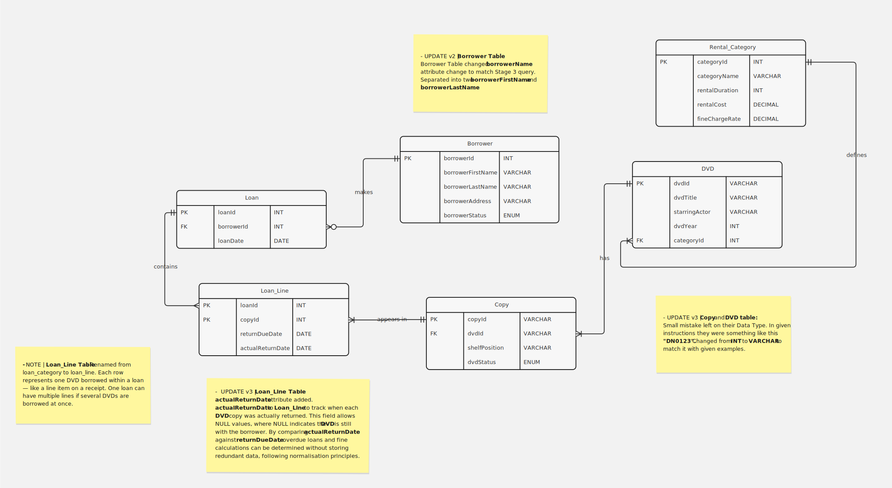

# IY455 — Implementation Model
### Information Systems Analysis and Design

> **Module:** IY455 | **Student ID:** P500796 | **Group:** B  
> **Tutor:** Mustafa Ghashim  
> **Institution:** Nottingham Trent International College

---

## Overview

This repository contains the full implementation model for the **DVD Loan Management System** — a relational database designed, normalised, and implemented across three stages as part of the IY455 coursework.

---

## Project Structure

```
IY455/
├── README.md
├── reports/
│   ├── stage_1.md          ← Normalisation & ERD
│   ├── stage_2.md          ← DDL SQL (Create Database)
│   └── stage_3.md          ← DML SQL (Queries)
├── images/
│   ├── ERD.svg                   ← Entity Relationship Diagram
│   ├── UNF.png        ← Un-normalised Form
│   ├── 1NF.png        ← First Normal Form
│   ├── 2NF.png        ← Second Normal Form
│   ├── 3NF.png        ← Third Normal Form
│   ├── tables.png                ← SHOW TABLES output
│   ├── rental_category.png       ← Rental_Category table data
│   ├── borrower.png              ← Borrower table data
│   ├── dvd_p1.png                ← DVD table data (page 1)
│   ├── dvd_p2.png                ← DVD table data (page 2)
│   ├── dvd_p3.png                ← DVD table data (page 3)
│   ├── copy.png                  ← Copy table data
│   ├── loan.png                  ← Loan table data
│   └── loan_category.png         ← Loan_Category table data
└── sql/
    ├── create_tables.sql         ← DDL statements
    └── queries.sql               ← DML statements
```

---

## Stages

### Stage 1 — Normalisation & ERD
> **Status:** Complete ✅ 

- Normalised the DVD Loan Management System data from UNF through to 3NF
- Produced an Entity Relationship Diagram showing all 6 entities, attributes, keys and cardinalities
- Final 3NF tables: `BORROWER`, `LOAN`, `LOAN_CATEGORY`, `COPY`, `DVD`, `RENTAL_CATEGORY`

---

### Stage 2 — DDL SQL (Create Database)
> **Status:** Complete ✅ | **Submitted:** 21nd March 2026

- Created all 6 tables in DataGrip using DDL SQL statements
- Defined correct data types, primary keys, foreign keys and ENUM constraints
- Populated tables with 100 DVD records provided by the module tutor
- Added sample borrower, copy, loan and loan line data
- Verified all tables using SELECT statements

---

### Stage 3 — DML SQL (Queries)
> **Status:** Complete ✅ | **Due:** 29th March 2026

SQL queries to cover:
- All borrowers with current rentals ordered by surname
- Borrowers with overdue loans ranked highest to lowest
- Borrowers who rented comedy movies in the last 4 weeks
- Borrower with the most accumulated overdue fines
- Update rental costs for superhero movies released ≥ 2015 to £5.50
- Remove DVDs with no loan records

---

## Database Schema

| Table | Primary Key | Type | Description |
|---|---|---|---|
| `Rental_Category` | categoryId | INT AI | Rental durations, costs and fine rates |
| `Borrower` | borrowerId | INT AI | Borrower personal details and status |
| `DVD` | dvdId | VARCHAR(10) | DVD titles, actors and year |
| `Copy` | copyId | INT AI | Individual physical DVD copies |
| `Loan` | loanId | INT AI | Records each loan event |
| `Loan_Category` | loanId + copyId | Composite PK | Junction table linking loans to copies |

---

## Entity Relationship Diagram



---

## Normalisation Summary

| Stage | Rule Applied | What Changed |
|---|---|---|
| UNF | None | Raw data with repeating groups |
| 1NF | Remove repeating groups | Flat table with composite PK (LoanNo + CopyNo) |
| 2NF | Remove partial dependencies | Split into BORROWER, LOAN, LOAN_CATEGORY, COPY, DVD |
| 3NF | Remove transitive dependencies | Extracted RENTAL_CATEGORY from DVD table |

---

## Key Design Decisions

- `dvdStatus` and `borrowerStatus` use **ENUM** to restrict values to those defined in the scenario
- `dvdId` uses **VARCHAR** to preserve the original DVD codes from the teacher's dataset
- `TotalLoanCost` and `BorrowerTotalFine` were **excluded** as they are calculated fields
- `Loan_Category` uses a **composite primary key** (loanId + copyId) with no surrogate ID
- `ReturnDueDate` is stored in `Loan_Category` not `Loan` as different copies have different durations

---

## Tools Used

| Tool | Purpose |
|---|---|
| DataGrip | Database creation and SQL execution |
| Miro | Entity Relationship Diagram |
| Microsoft Excel | Normalisation tables |
| GitHub | Version control |
